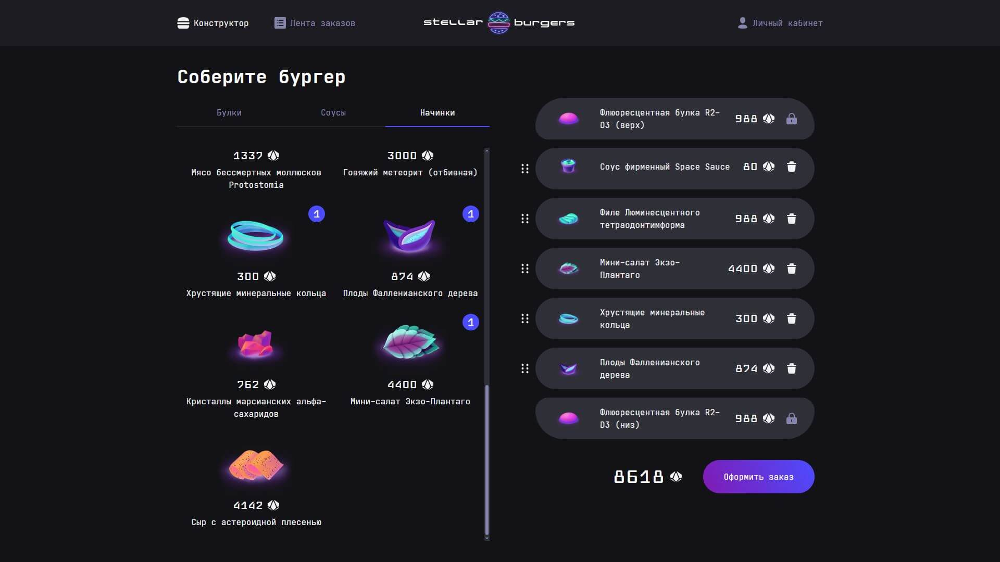

# Проект "Космическая бургерная Stellar Burgers"

## О проекте

**Stellar Burgers** — одностраничное веб-приложение (SPA) в стиле футуристической бургерной. Пользователь может собирать собственные бургеры, оформлять заказы и отслеживать их в реальном времени. Приложение разработано с использованием функциональных компонентов React и типизировано с помощью TypeScript.

Реализована маршрутизация, drag-and-drop функциональность, взаимодействие с сервером через WebSocket, а также адаптивный интерфейс.

Проект выполнен в рамках курса «Веб-разработчик +» в качестве итоговой проектной работы.

## Превью проекта

<!-- Замените путь на актуальный, если изображение доступно -->


## Ссылка на демо

- [Открыть приложение](https://react-burger-iota.vercel.app/)

## Статус проекта

✅ Завершён и задеплоен.

## Функциональность

- **Конструктор бургеров** с drag-and-drop:
  - Добавление ингредиентов.
  - Подсчёт стоимости заказа.
- **Просмотр заказов в реальном времени** через WebSocket.
- **Авторизация и регистрация**.
- **История заказов пользователя**.
- **Адаптивный интерфейс**.
- **Маршрутизация страниц** (React Router).
- **Типизация компонентов** через TypeScript.
- **Защищённые маршруты** и работа с токенами.

## Технологии и инструменты

- **HTML5** — Семантическая структура.
- **CSS3** — Flexbox, стилизация.
- **JavaScript / TypeScript** — Логика приложения, типизация.
- **React** — Функциональные компоненты, хуки.
- **React DnD** — Реализация drag-and-drop.
- **React Router DOM** — Маршрутизация.
- **WebSocket** — Онлайн-обновление заказов.
- **Vercel** — Деплой проекта.

## Как запустить проект локально

1. Клонируйте репозиторий:

  ```bash
  git clone https://github.com/kirill-io/react-burger.git
  ```

2. Перейдите в директорию проекта:

  ```bash
  cd stellar-burgers
  ```

3. Установите зависимости:

  ```bash
  npm install
  ```

4. Запустите проект в режиме разработки:

  ```bash
  npm start
  ```

5. Для запуска тестов:

  ```bash
  npm test
  ```

6. Для финальной сборки проекта:

  ```bash
  npm run build
  ```

## Проверка кода

- Проверка TypeScript:

  ```bash
  npm run lint
  ```

- Автоисправление ошибок:

  ```bash
  npm run lint:fix
  ```
